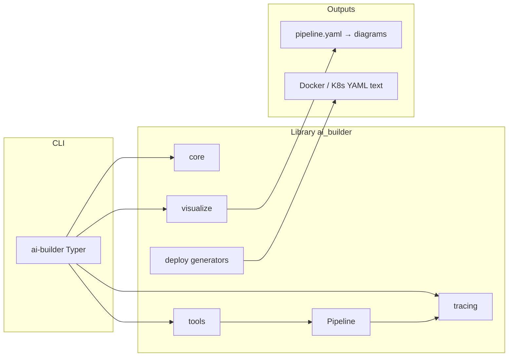

# Architecture and repository layout

This page describes **how the Git repository is organized**, **where the installable package lives**, and **how runtime pieces fit together**.

---

## Repository vs package

| Layer | Path | Role |
|-------|------|------|
| **Git repository root** | `Agent-builder/` (clone directory; name may vary) | License, root README, **`docs/`**, **`AGENTS.md`**, **`ai-builder/`** package subtree |
| **Python package project** | **`ai-builder/`** | **`pyproject.toml`**, **`src/`**, **`tests/`**, **`uv.lock`** — this is what `pip` installs via `` |
| **Importable library** | **`src/`** (logical package **`ai_builder`**) | Source files live **directly under `src/`**; setuptools maps them to **`import ai_builder`** via **`package-dir`** (see below). |

Installing from GitHub uses the **`ai-builder`** subdirectory so the repo can hold docs and metadata at the top level without being part of the wheel layout.

### Flat `src/` layout (no `src/ai_builder/` folder)

Physical directories **`src/core/`**, **`src/tools/`**, … sit **next to** **`src/__init__.py`** and **`src/cli.py`**. There is **no** nested **`src/ai_builder/`** directory in git.

Setuptools configuration (`pyproject.toml`):

- **`[tool.setuptools.package-dir]`** maps **`ai_builder`** → **`src`** so **`ai_builder.cli`** resolves to **`src/cli.py`**, **`ai_builder.core`** → **`src/core/`**, etc.
- **`packages`** lists every **`ai_builder.*`** subpackage explicitly (required because automatic discovery would otherwise register **`core`**, **`tools`** as top-level names).

Build artifacts **not** committed:

| Path | Notes |
|------|--------|
| **`*.egg-info/`** | From **`pip install -e .`** — gitignored. |
| **`__pycache__/`** | Bytecode — gitignored; safe to delete locally. |

When you **add a new Python subpackage** under `src/` with **`__init__.py`**, append the corresponding **`ai_builder....`** name to **`packages`** in **`pyproject.toml`**.

---

## Repository file structure (top level)

Conceptual tree (files that ship in git; local-only items like `.venv` may exist on your machine):

```
Agent-builder/                    # repository root
├── README.md
├── LICENSE
├── AGENTS.md
├── .gitignore
├── docs/
│   └── …
└── ai-builder/
    ├── pyproject.toml            # package-dir + explicit packages list
    ├── README.md
    ├── uv.lock
    ├── src/                      # ← all library source (flat); import name still ai_builder
    │   ├── __init__.py
    │   ├── cli.py
    │   ├── core/
    │   ├── tools/
    │   ├── tracing/
    │   ├── templates/
    │   ├── deploy/
    │   ├── visualize/
    │   └── commands/
    └── tests/
```

Anything **outside** `ai-builder/` is **not** installed when you `pip install …` unless you vendor it yourself.

---

## Python package layout (`src/` → `ai_builder`)

Installed **import name** remains **`ai_builder`**:

```
src/
├── __init__.py              # ai_builder.__init__
├── __main__.py             # python -m ai_builder
├── cli.py                   # Typer entry: console script ai-builder
├── core/
├── tools/
│   ├── document_loader/
│   ├── splitter/
│   ├── embedder/
│   ├── vector_store/
│   ├── retriever/
│   ├── llm/
│   └── web_search/
├── tracing/
├── templates/
├── deploy/
├── visualize/
└── commands/
```

### Tools layer (high level)

| Directory under `tools/` | Purpose |
|--------------------------|---------|
| **`document_loader/`** | Umbrella loader + **`loader_*`** packages + **`common/`** |
| **`splitter/`** | Recursive text chunking |
| **`embedder/`** | Embeddings |
| **`vector_store/`** | FAISS / Chroma / Qdrant writers |
| **`retriever/`** | Similarity search |
| **`llm/`** | **`LLMTool`**, **`connectors/`** |
| **`web_search/`** | Tavily-backed search |

---

## Runtime architecture (conceptual)

End users drive **`ai-builder`** (CLI) or import **`ai_builder`** from application code.



---

## Design rules

- **Tool contract:** **`ToolInput` → ToolOutput`**; composition **`tool_a | tool_b`**.
- **Configuration:** **`BaseConfig`** + **`.env`** (pydantic-settings).
- **Optional heavylifting:** torch, LangChain, vector DB clients ship as **extras** in **`pyproject.toml`**, not mandatory core deps.

See also [AGENTS.md](../AGENTS.md) and [Repository README – architecture](../README.md#architecture-overview).
